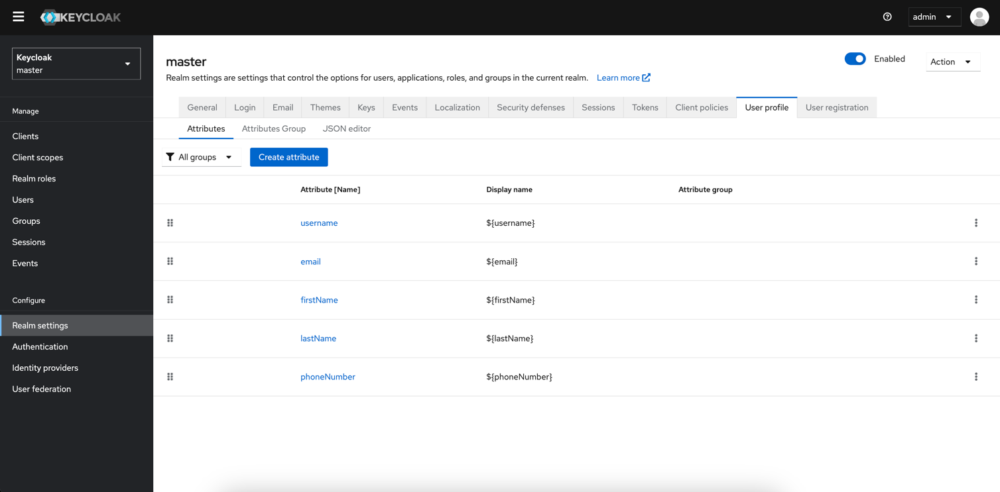
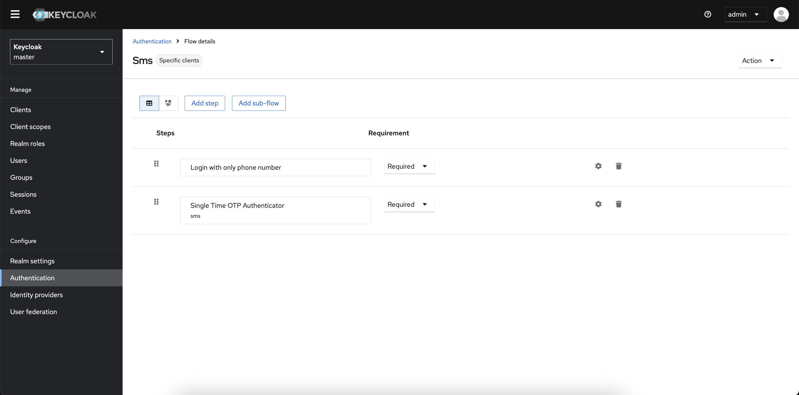
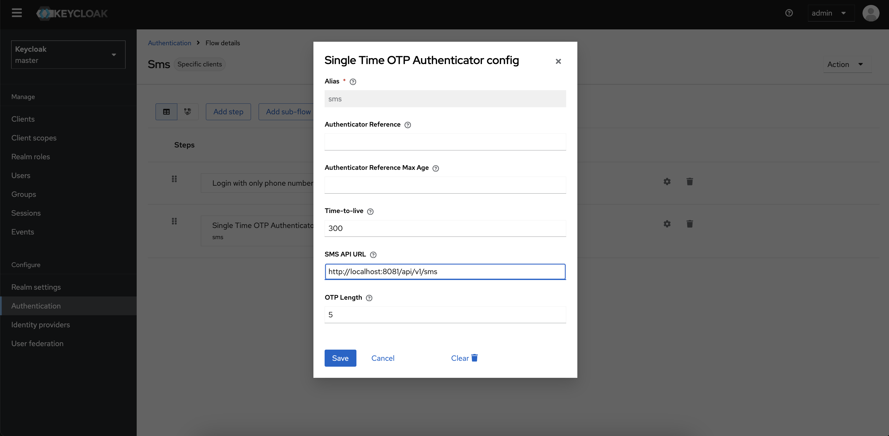
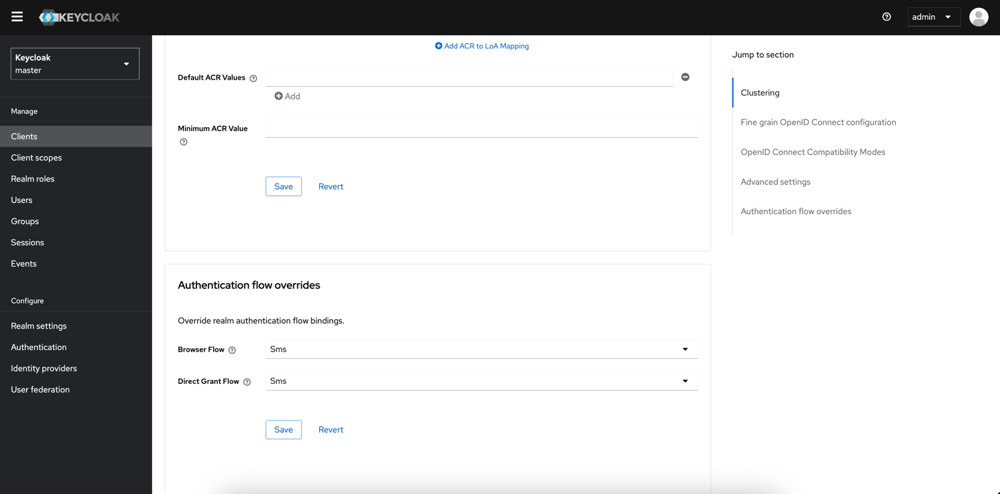

# Keycloak OTP Extension

This project provides custom authenticators for Keycloak to enhance its OTP (One-Time Passcode) capabilities. It includes:

- **Phone Number Only Authenticator**: Allows authentication using only a phone number.
- **OTP Authenticator**: Enhances the default OTP authentication mechanism.

## Features

- Customizable authentication flows.
- Integration with external services for OTP delivery.
- Support for various OTP algorithms and configurations.

## Prerequisites

- **Java Development Kit (JDK)**: Ensure you have JDK installed.
- **Apache Maven**: Required for building the project.
- **Docker**: Used for containerizing the application.

## How it works
It allows users to sign in/up with their phone number. For this matter, adding the [phone number attribute](#necessary-attribute-phonenumber-field)
to the Realm user profile attributes is **necessary**. You have to create a new authentication flow
in order to get this authentication mechanism up & running.
This extension will generate an OTP ([length can be configured through Keycloak](#available-configuration-on-otp-extension)) and send an HTTP POST request
to a backend ([can be configured through Keycloak](#available-configuration-on-otp-extension)) with this payload:
```json
{
  "phoneNumber": "+1(252) 261-5179",
  "otpCode": "31311"
}
```
Also, [OTP TTL is configurable](#available-configuration-on-otp-extension).

#### Necessary attribute (phoneNumber field)

#### Example authentication flow

#### Available configuration on OTP extension

#### Setting the authentication flow in client


## Installation

1. **Clone the Repository**:

   ```bash
   git clone https://github.com/Alireza-Kiani/keycloak-otp-extension.git
   cd keycloak-otp-extension
    ```
2. **Build the Project**:
   ```bash
    mvn clean package -DskipTests
   ```
3. **Build the Project**:
   ```bash
    docker build -t keycloak-otp-extension .
   ```
4. **Build the Project**:
   ```bash
     docker run -p 8080:8080 keycloak-otp-extension
   ```
